1 静态资源服务 比node 性能好
2 权限控制
3 反向代理
4 正向代理
5 负载均衡

## nginx 优势
1. 高并发高性能
2. 可扩展性好
3. 热部署
4. 开源许可证

### 环境
centos7 64 位
#### 3.1 启用网卡
    vi /etc/sysconfig.netwwork-scripts/ifcfg-ens33
    ONBOOT=YES
### 3.2 关闭防火墙
> 停止防火墙 systemctl stop firewalld.service
> 新版语法 systemctl stop firewalld
> 永久关闭防火墙 systemctl disable firewalld.service
### 3.3 确认停用 selinux
+ 安全增强型 Linux (Security-Enhanced Linux) 简称SELinux, 是一个linux 内核模块， 也是一个linux 的安全子系统
+ SELinux 主要作用就是最大限度的减小系统中服务进程可访问的资源(最小权限原则)
  
  | 功能         | 命令    |  
  | :---        | :---  | 
  | 检查状态      | getenforce|
  | 临时关闭      | /usr/sbin/sestatus -v|
  | 永久关不      | /etc/selinux/config SELINUX= enforcing 改为SELINUX = disabled|
### 3.4 安装依赖模块
> yum -y install gcc gcc-c++ autoconf pcre pcre-devel make automake
> yum -y install wget httped-tools vim

| 功能        | 命令    |  
| :---:        | :---
|gcc         | gcc是指整个gcc的这一 套工具集合，它分为gcc前端和gcc后端(我个人理解为gcc外壳和gcc引擎) , gcc前端对应各种特定语言(如c++/go等) 的处理(对c++/go等特定语言进行对应的语法检查,将c++/go等语言的代码转化为c代码 等)，gcc后端对应把前端的c代码转为跟你的电脑硬件相关的汇编或机器码|
|gcc-c++     | 而就软件程序包而言，gcc.rpm就是那个gcc后端，而gcc-c++ .rpm就是针对c++这个特定语言的gcc前端|
| autoconf   | autoconf是一个软件包，以适应多种Unix类系统的shell脚本的工具|
|pcre        | PCRE(Perl Compatible Regular Expressions)是一 个Perl库， 包括perl兼容的正则表达式库|
|pcre-devel   |  devel包主要是供开发用,包含头文件和链接库| 
|make| 常指一条计算机指令，是在安装有GNU Make的计算机上的可执行指令。该指令是读入-个名为makefile的文件， 然后执行这个文件中指定的指令|
|automake| automake可以用来帮助我们自动地生成符合自由软件惯例的Makefile|
|wget|wget是一个从网络上自动下载文件的自由工具，支持通过HTTP、HTTPS、FTP三个最常见的TCP/IP协议下载，并可以使用HTTP代理|
|httpd-tools |apace压力测试|
#5. nginx 安装
## 5.1 版本分类
+ 开发版(Mainline version)
+ Stable Version(稳定版 )
+ legacy version (历史版本)

[nginx](http://nginx.org/en/download.html)
[package](http://nginx.org/en/linux_packages.html#stable)
+ 查看安装的位置 
>rpm -ql nginx
> 
清除注释 
+  "cat default.conf(文件夹名字) | grep -v '#' "
+ 主要配置文件
  
  |路径   |用途   |
  |---|---|
  |/etc/nginx/nginx.conf|核心配置文件|
  |etc/nginx/conf.d/default.conf|默认http服务器配置文件|

+ cgi 配置
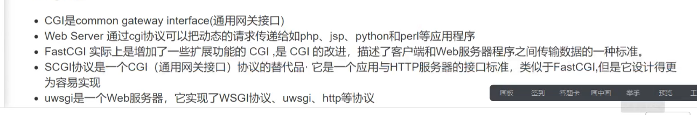 
  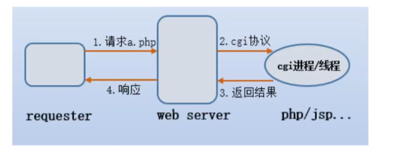
    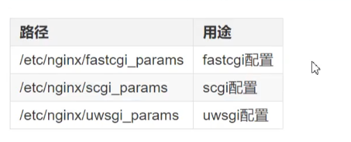
  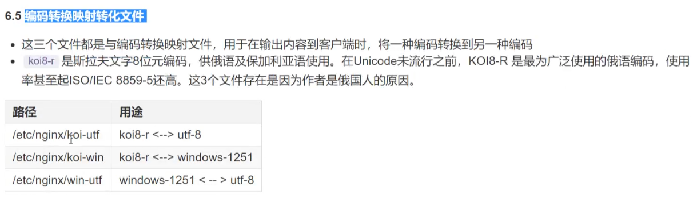
  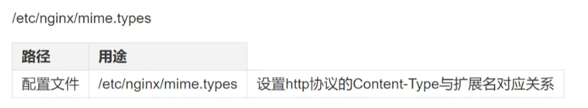
  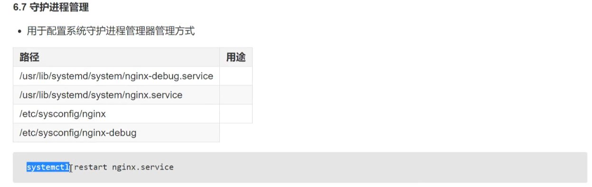
  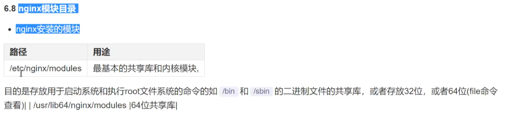
  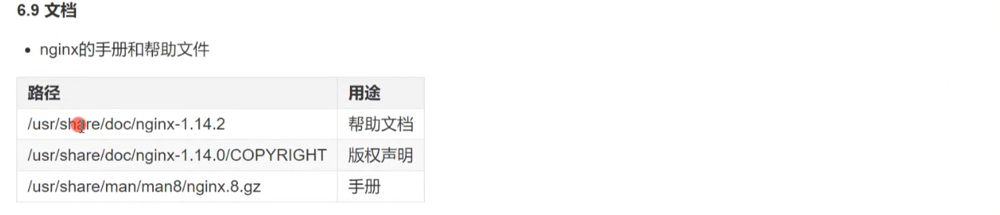
  
  
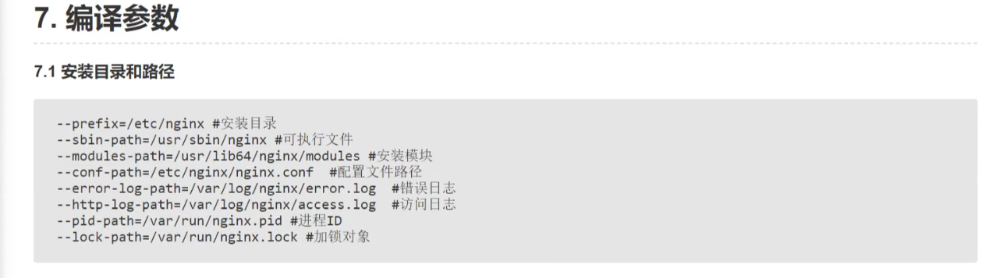
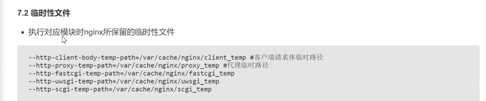
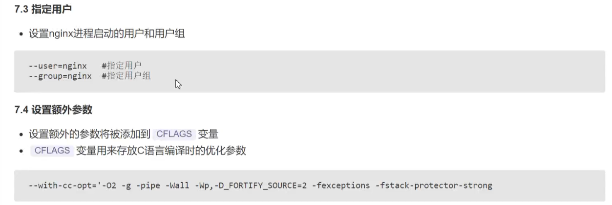 
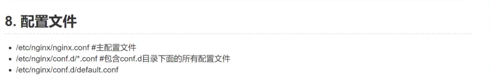
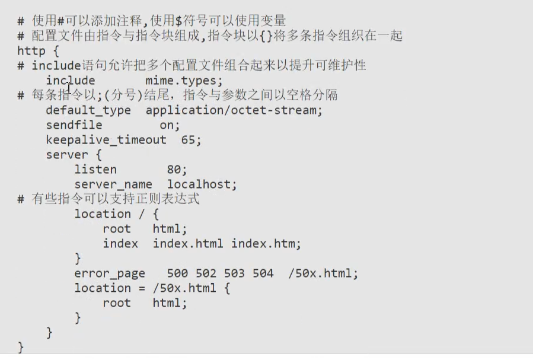
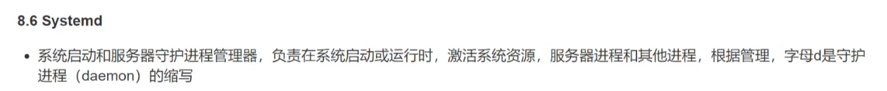
 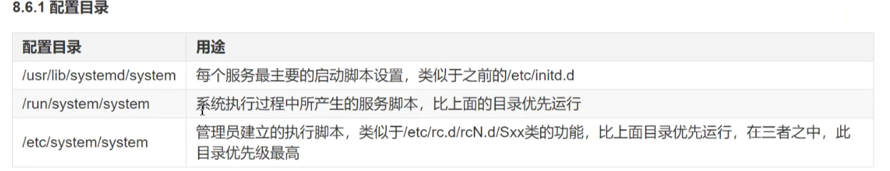
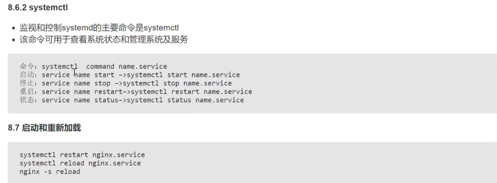
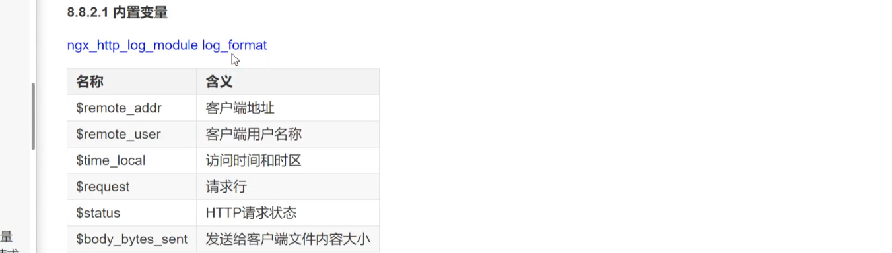
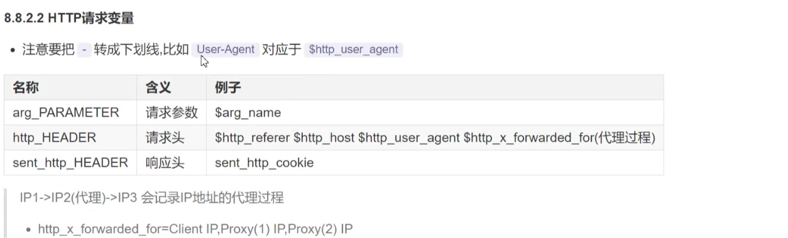
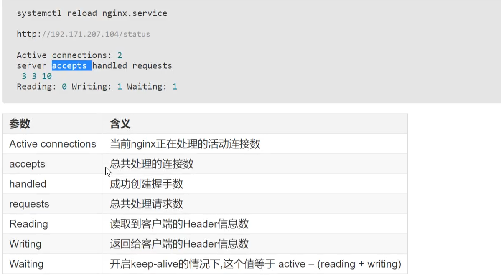
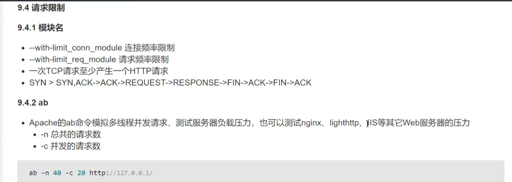
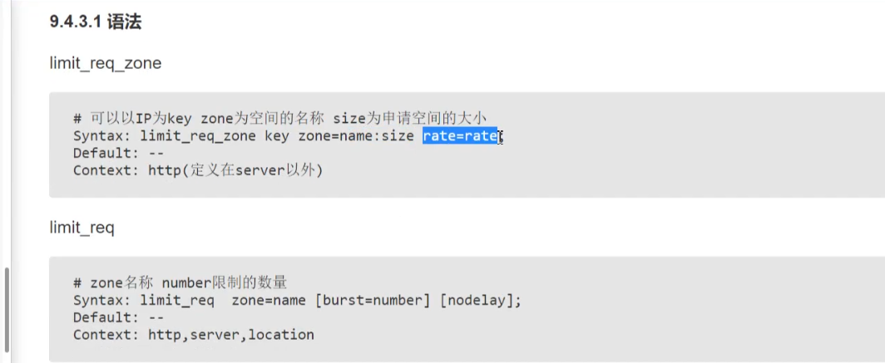